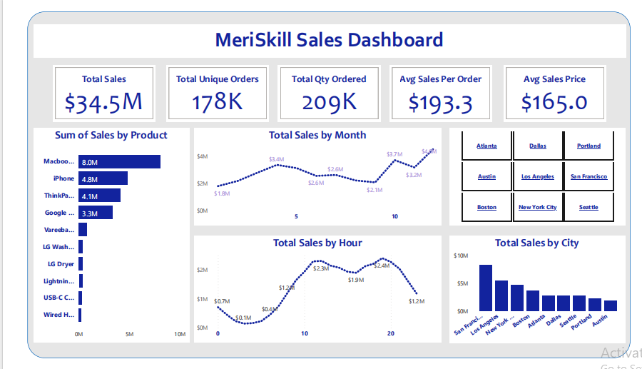

# MeriSkill-Sales-Analysis

## Table of Content
- [Overview](#overview)
- [Purpose](#purpose)
- [Description](#description)
- [Data Format](#data-format)
- [Tools](#tools)
- [Data Preparation](#data-preparation)
- [Exploratory Data Analysis](#exploratory-data-analysis)

  
  
## Overview
This Project was assign by MeriSkill in other to understand the level of individuals understanding to Data analysis. MeriSkill Internship program in a virtual program.

## Purpose: 
Analyze sales data to identify trends, top-selling products, and revenue metrics for business decision-making.

## Description: 
In this project, you will dive into a large sales dataset to extract valuable insights. You will explore sales trends over time, identify the best-selling products, calculate revenue metrics such as total sales and profit margins, and create visualizations to present your findings effectively. This project showcases your ability to manipulate and derive insights from large datasets, enabling you to make data-driven recommendations for optimizing sales strategies.

## Data Format:
The primary format of the dataset is "sales.csv" containing detailed information of the company for analysis.

## Tools:
- Microsoft Excel: Data cleaning
- SQL: Data manipulation
- PowerBI: Data visualization

## Data Preparation
The data cleaning/preparation phase was done by doing the following;
1. Data loading
2. Checking for redundancies
3. Handling missing values
4. Removing duplicate values

## Exploratory Data Analysis
- Explore sales trend over time
- identify the best selling product
- identify the total sale for each product
- identify the average sale for each product.
